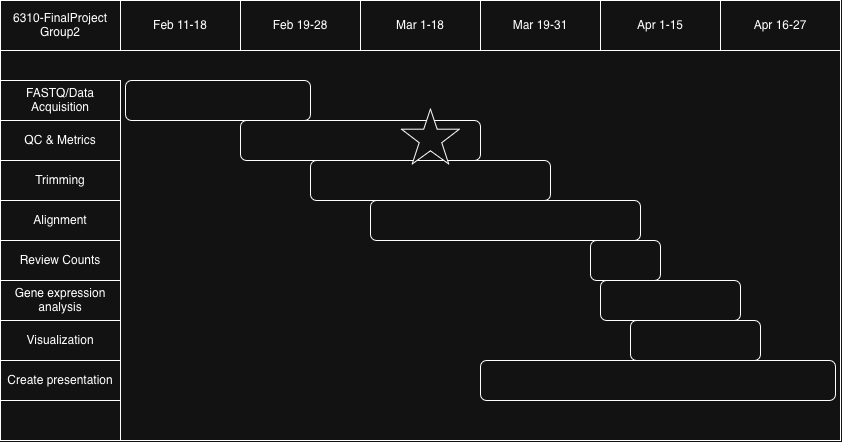

# Reproducibility Study: Bulk RNA-seq of skeletal muscle reveals the role of ZBED6 in sepsis-induced muscle atrophy in minipigs. (Liu et al., 2025)

# Final Project for BINF-6310

## Authors:

- Zane Deso

- Carson Hunter

- Ildiko Polyak

## Time line

## **Pre-requisites**

- [python 3.10+](https://www.python.org/downloads/)
- [pip](https://pypi.org/project/pip/)
- [r 4.3+](https://www.r-project.org/)
- [Conda](https://docs.conda.io/projects/conda/en/latest/user-guide/install/index.html)
- [FastQC](https://www.bioinformatics.babraham.ac.uk/projects/fastqc/)
- [SRA Toolkit](https://github.com/ncbi/sra-tools)
- [STAR v2.7.6a](https://github.com/alexdobin/STAR)
- [DESeq2 v1.45.0](https://github.com/thelovelab/DESeq2)
- [dplyr v1.1.4](https://github.com/tidyverse/dplyr)
- [ggplot2 v3.5.1](https://github.com/tidyverse/ggplot2)

Please see environment/README.md for guide on installing/setting up environment for Linux distro.

## Progress (3/10/2026)

 * Added supporting directories for logs, results/metadata, results/raw_fastq, results/star_index, results/deseq2, results/figures, and results/qc/{raw,trimmed}.

 * Confirmed the public study identifiers and scoped the project around the sepsis-induced minipig RNA-seq dataset.

 * Downloaded SRA Run Selector metadata for the study.

 * Created a script to convert the raw SRA metadata export into a clean config/samples.tsv.

 * Generated and validated samples.tsv with 54 samples across 9 regions, with 3 WT and 3 KO per region.

 * Set up a config/test_samples.tsv for controlled test runs before scaling.

 * Verified that the download script correctly converted SRA data to gzipped paired-end FASTQ files and cleaned temp/cache files afterward.

 * Confirmed the naming scheme for downloaded files matched the cleaned sample metadata.

 * Wrote and ran the raw FastQC step on the 2 test samples.

 * Verified FastQC produced the expected HTML and ZIP reports in results/qc/raw.

 * Added a .gitignore strategy to keep raw sequencing data, SRA files, cache/temp files, and large intermediates out of GitHub.

### License:

- MIT License -> see LICENSE.txt
 
